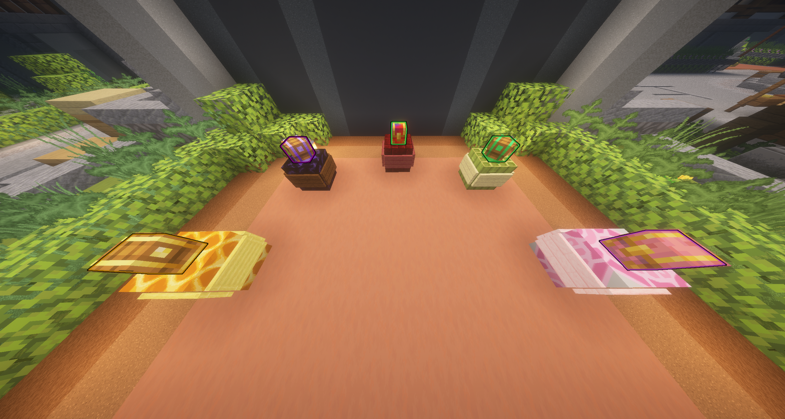
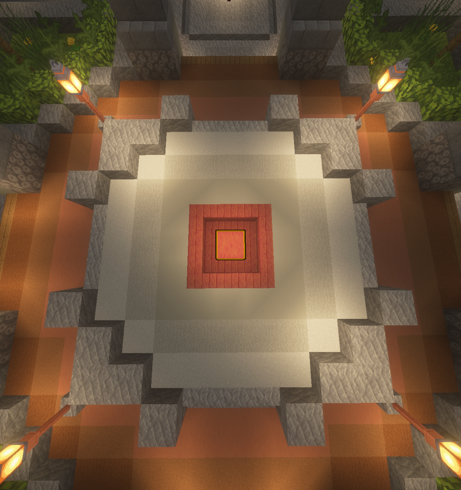
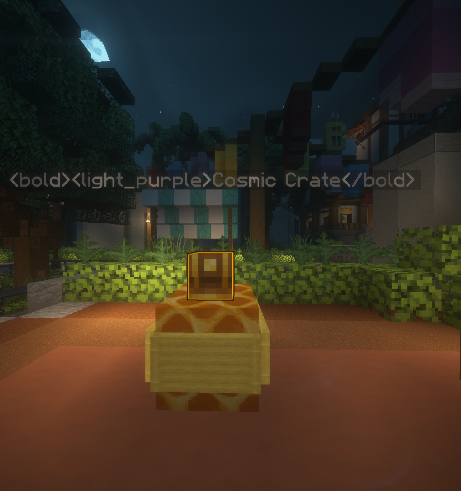
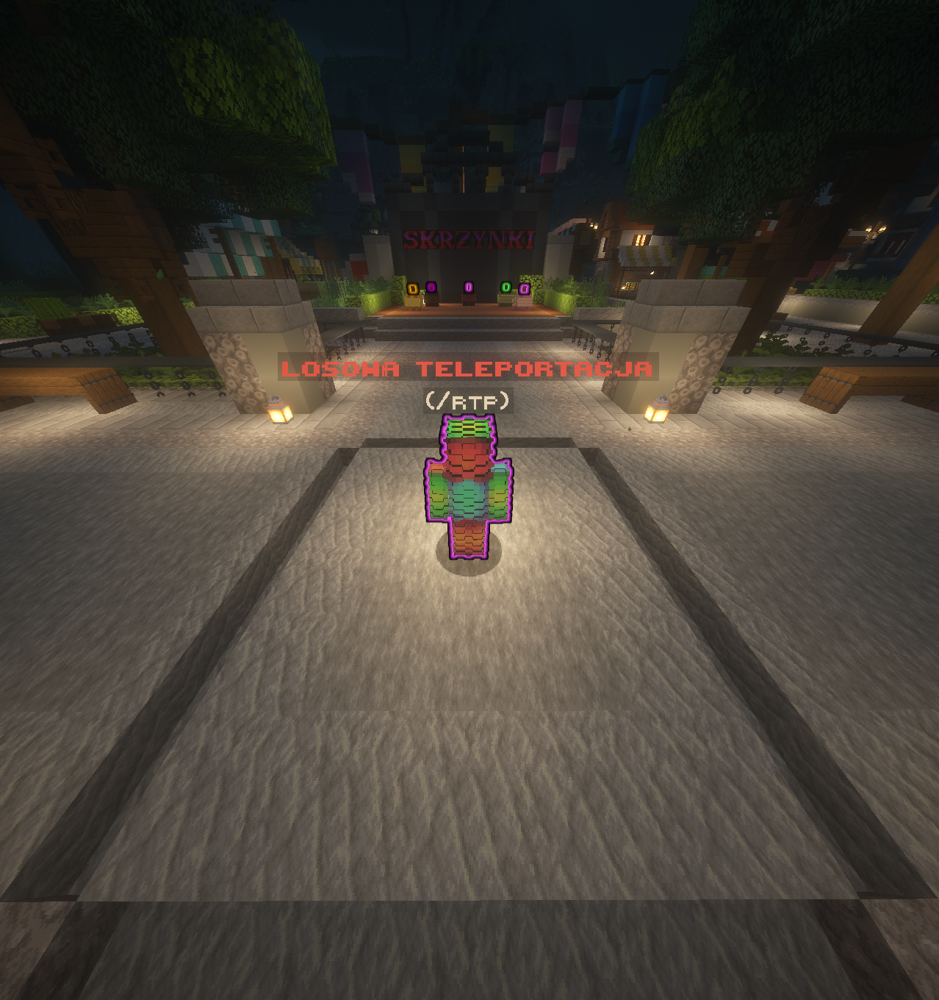

<div align="center">


# ✨ GlowingBlocks

**Colored outlines for blocks, player heads & Citizens NPCs.**

Highlight crates, guide players to NPCs, and bring important locations into view.

[](#-requirements--dependencies)
[](#-requirements--dependencies)
[](LICENSE)
[](https://www.spigotmc.org/resources/glowingblocks-npc-heads.129797/)

[SpigotMC](https://www.spigotmc.org/resources/glowingblocks-npc-heads.129797/) · [Commands](#-commands) · [Configuration](#-configuration) · [Report an issue](https://github.com/tremeq/GlowingBlocks-NPC-Heads-Blocks/issues)



</div>

## 📢 About GlowingBlocks

GlowingBlocks adds configurable glowing outlines to your Paper server. Choose a static color or rainbow animation, make an effect private or global, and keep it saved across restarts.

Use it to highlight crate locations, decorate your spawn, or make quest and teleport NPCs easier to find. **Glowing blocks remain clickable** — their visual outlines have no hitbox.

Found a bug? [Open an issue](https://github.com/tremeq/GlowingBlocks-NPC-Heads-Blocks/issues) with your Paper version, Citizens version if applicable, and steps to reproduce it.

---

<p align="center"></p>

## ✨ Core Features

- **Blocks & player heads** — colored outlines with support for player-head textures.
- **Citizens NPCs** — apply the same color and visibility options to NPCs, with name tags hidden while glowing.
- **16 colors + rainbow** — choose a fixed color or configure an animated palette and interval.
- **Private & global visibility** — each player can have their own effect on the same object; a private effect takes priority over the global one.
- **Normal block interaction** — open highlighted chests and interact with blocks through their outlines.
- **Persistent effects** — restore saved block and NPC effects after a restart.
- **Live configuration reload** — update settings and reapply effects with `/ge reload`.
- **Configurable messages & limits** — customize the prefix, messages, detection range, and saved block limits.
- **Optional Citizens integration** — block features work without Citizens. No ProtocolLib required.

## 📸 In-Game Preview

<table>
  <tr>
    <th>Golden outline</th>
    <th>Player-head crate</th>
    <th>Citizens NPC</th>
  </tr>
  <tr>
    <td width="33%"><a href="docs/images/blocks.png"></a></td>
    <td width="33%"><a href="docs/images/heads.png"></a></td>
    <td width="33%"><a href="docs/images/npcs.png"></a></td>
  </tr>
</table>

Screenshots from the [SpigotMC resource page](https://www.spigotmc.org/resources/glowingblocks-npc-heads.129797/). Server builds, skins, shaders, and floating labels shown in the images belong to that server setup. Click a preview to open the full image.

---

## 📦 Requirements & Dependencies

| Component | Requirement |
| --- | --- |
| Server | **Paper 1.19.4+**. Spigot, Bukkit, and Folia are not supported. |
| Java | **17+**, or the newer Java version required by your server release. |
| Citizens | **Optional** — required only for NPC features. Use a build compatible with your server. |
| ProtocolLib | Not required. |

The bundled GlowingEntities library is included in the JAR. You do not need to install it separately.

> The current renderer requires Minecraft 1.19.4 or newer. Runtime checks were performed on **Paper 1.20.4 build 336**, with **Citizens 2.0.33 build 3382** and without Citizens. NPC packet compatibility with every newer release has not been verified. See the [test report](TESTING.md).

## 🚀 Installation

1. Download a compatible build from [SpigotMC](https://www.spigotmc.org/resources/glowingblocks-npc-heads.129797/) or [build this source](#-building-from-source).
2. Stop your server and place `glowingblocks-2.0.0.jar` in `plugins/`, replacing the previous JAR if upgrading.
3. Install Citizens if you want NPC effects.
4. Start the server. Configuration is created in `plugins/GlowingBlocks/`.
5. Look at a block and run `/gb GOLD global` as an operator.

Keep your existing configuration and `saves.yml` when upgrading. Restart the server after replacing the JAR; `/ge reload` reloads settings and data, not plugin code.

---

<p align="center"></p>

## 🎮 Commands

### Blocks

```text
/glowblock [color|rainbow] [private|global]
/unglowblock [private|global]
```

Look at the block you want to change. The default detection range is **5 blocks** and the default color is **RED**.

Aliases: `/gb`, `/glow`, `/ugb`, `/unglow`.

### Citizens NPCs

```text
/glownpc <id|name> [color|rainbow] [private|global]
/unglownpc <id|name> [private|global]
```

Use the NPC's **ID** if its name contains spaces. Effects can be saved while an NPC is despawned and applied when it spawns again. The console must specify `global` when creating NPC effects.

Aliases: `/gnpc`, `/ugnpc`.

### Administration

| Command | Description |
| --- | --- |
| `/ge help` | Show command help. |
| `/ge list` | Show counts of saved block effects, animated block effects, and NPC effects. |
| `/ge save` | Save all effects to disk. |
| `/ge reload` | Reload configuration and saved data, then reapply effects. |
| `/ge version` | Show the plugin version. |

Full command: `/glowingentities`. Aliases: `/ge`, `/glowing`. Command aliases can be disabled in configuration. Effect-changing commands have a **0.5-second cooldown per player**.

### Quick Examples

```text
/gb RED private
/gb RAINBOW global
/ugb private
/glownpc 12 GOLD global
/unglownpc 12 global
```

## 👁️ Private & Global Effects

- **Private** — only the effect's owner sees it.
- **Global** — visible to players observing that object.
- **Both on the same object** — your private effect takes priority. Removing it reveals the global effect again without changing anyone else's private effect.

Creation commands use `defaults.visibility` when no mode is provided; the default is `private`. Removal commands first select your private effect, then the global effect if you have no private one. Editing global effects requires additional permission.

## 🔑 Permissions

All permissions below default to **operators**.

| Permission | Description |
| --- | --- |
| `glowingblocks.glowblock` | Create or change block effects. |
| `glowingblocks.unglowblock` | Remove block effects. |
| `glowingblocks.glownpc` | Create or change NPC effects. |
| `glowingblocks.unglownpc` | Remove NPC effects. |
| `glowingblocks.global` | Additional permission to create, edit, or remove global effects. |
| `glowingblocks.admin` | Use administrative commands; also satisfies the additional global permission check. |

---

## 🌈 Colors & Animation

```text
BLACK         DARK_BLUE     DARK_GREEN    DARK_AQUA
DARK_RED      DARK_PURPLE   GOLD          GRAY
DARK_GRAY     BLUE          GREEN         AQUA
RED           LIGHT_PURPLE  YELLOW        WHITE
```

Use `RAINBOW` instead of a color to animate the outline. Names are case-insensitive.

Default cycle: **RED → GOLD → YELLOW → GREEN → AQUA → BLUE → LIGHT_PURPLE**, changing every **20 ticks** (one second at 20 TPS).

## ⚙️ Configuration

Edit `plugins/GlowingBlocks/config.yml`, then run `/ge reload`. View the [complete default configuration](src/main/resources/config.yml).

```yaml
rainbow:
  enabled: true
  interval-ticks: 20
  colors: [RED, GOLD, YELLOW, GREEN, AQUA, BLUE, LIGHT_PURPLE]

defaults:
  visibility: private
  raycast-range: 5

features:
  global-mode: true
  rainbow-animation: true
  npc-glow: true
  auto-save: true
  command-aliases: true

performance:
  max-blocks-per-player: 1000
  max-global-blocks: 500
  chunk-load-delay: 1
  player-join-delay: 1
```

- Both rainbow switches must be enabled for animation. Disabling animation uses the saved static color.
- Disabling global or NPC features hides those effects while retaining their saved data.
- Block limits apply to saved entries. A limit of `0` prevents new entries; existing ones can still be edited or removed.
- Automatic saving batches changes after **100 ticks** and saves again on shutdown. If disabled, use `/ge save`.
- Customize text and the prefix under `messages`; `&` color codes are supported.
- Invalid configuration or data is rejected during reload, retaining the active settings and data.

## 💾 Storage & Upgrades

Effects are stored in `plugins/GlowingBlocks/saves.yml`. Private effects retain their owner's UUID; unavailable worlds retain their saved entries.

Legacy data is migrated with a `saves.yml.v1.bak` backup. Old private NPC entries did not record an owner, so they are migrated as global with a warning in the server log.

**Edit `saves.yml` with the server stopped.** `/ge reload` first saves pending changes from memory, which could overwrite manual edits made while the server is running.

<details>
<summary><strong>Rendering and lifecycle details</strong></summary>

- Blocks use `BlockDisplay`; heads and supported block entities use `ItemDisplay`. Visual entities have no hitbox and are not saved as world entities.
- Item-rendered outlines can differ from special block models, such as open or double chests. Resource packs can also change the appearance.
- Destroying an observed block or changing its type removes its saved effects. Pistons remove effects from moved blocks; the effect does not follow the block.
- Leaving the server, changing worlds, and unloading chunks clean up visuals without deleting saved effects. The plugin does not load chunks just to render outlines.
- NPC glow teams hide name tags, including during rainbow animation. Stored Citizens names are not changed.
- NPC despawn retains the effect for the next spawn. Permanently removing an NPC removes its effects.

</details>

---

## 🔧 Recent Fixes

The current source includes fixes for:

- ✅ Independent private/global layers for blocks and NPCs.
- ✅ Data persistence, legacy migration, and reload validation.
- ✅ Clickable block outlines and cleanup when players or chunks unload.
- ✅ Citizens initialization and restoration of effects after restart.
- ✅ NPC name tags staying hidden when glow is enabled or its color changes.

Validation: **18 automated tests**, plus checks with two protocol clients on Paper 1.20.4. See [TESTING.md](TESTING.md) for the exact scope and limitations.

## 📚 Documentation

- [Default configuration](src/main/resources/config.yml) — all settings and configurable messages.
- [Polska instrukcja](docs/GUIDE.pl.md) — szczegółowa instrukcja po polsku.
- [Test report](TESTING.md) — environment, checks, and known verification limits (Polish).
- [SpigotMC resource](https://www.spigotmc.org/resources/glowingblocks-npc-heads.129797/) — published downloads and resource discussion.
- [Issue tracker](https://github.com/tremeq/GlowingBlocks-NPC-Heads-Blocks/issues) — bug reports and feature requests.

## 🛠️ Building from Source

With Maven and a suitable JDK installed:

```bash
mvn clean verify
```

Output: `target/glowingblocks-2.0.0.jar`.

## ❤️ Credits & License

**Plugin:** TremeQ · **Bundled library:** [GlowingEntities by SkytAsul](https://github.com/SkytAsul/GlowingEntities)

The bundled library includes local fixes for packet handling and effect cleanup. The MIT license notice is included in [LICENSE](LICENSE) and inside the JAR. Screenshot sources are recorded in [docs/images/README.md](docs/images/README.md).
